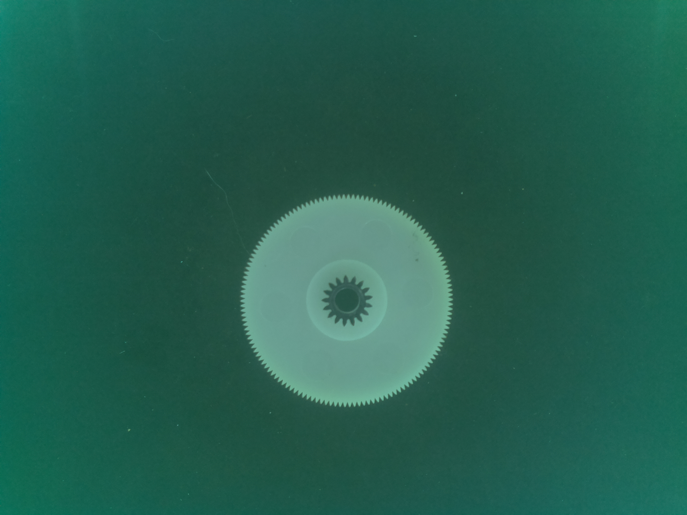
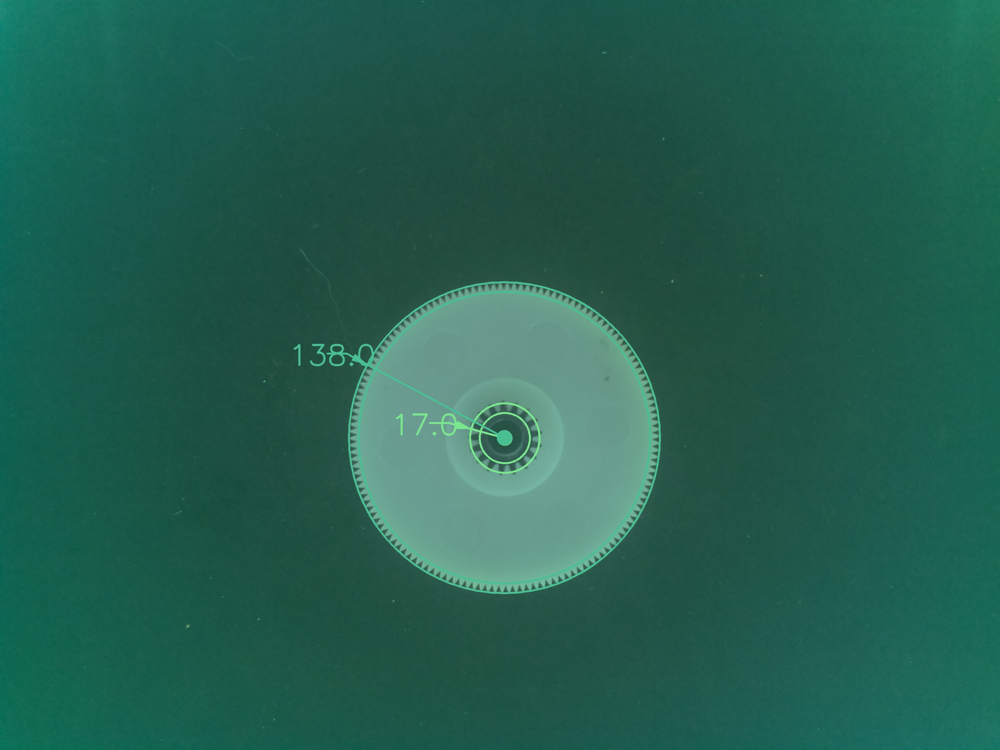

# gearcounter
opencv software to count teeth on gears - python





This version uses two algorythms to count teeth:
1) take the perimeter trace of the gear, convert it to polar, offset the resulting waveform by its average and count the zero crossings.

2) take a ring 10 pixels in from the edge of the circle and create an intensity waveform from the greyscale version of image, run this waveform thru an FFT.

If everything works nicely there will be two counts for each gear, and ideally, they will agree.
The FFT is drawn last, so its count will match the circle around the perimeter of the gear. Its more-often-than-not correct.


## MacOS installation

```shell
# create new miniconda environment:
conda create -p $PWD/.venv
# activate it 
conda activate $PWD/.venv
pip install -r requirements.txt
```

Run via:

```shell
python3 gearcounter3.py srcfile.jpg
```


-----

If the gear count is not an integer, it means there is a problem/uncertinty
Some erroneous counts are integers.


known failures, not understood yet:
(but the counter does NOT like lint!!!)

03 35 should be 33 terrible perspective
05 is a poor image, the fft isn't actually sure.
07 left gear in excessive shadow
18 not actually sure where the error comes from...
25 inner gear too blurry?
26 inner gear too blurry?
31 no contrast from outter gear to background
38 Hmmmm....
41 Hmmm....
42 Hmmm....
53 Ghost eh?
54 ghost.
60 no contrast between inner gear and background
65 is it the lint???
67 awful perspective on the 36 tooth gears
76 perim detection fail, this makes sense.
78 WHY??? shadows??


hopless images:
76
06 target does not fit in frame - use text recognition

notes on
